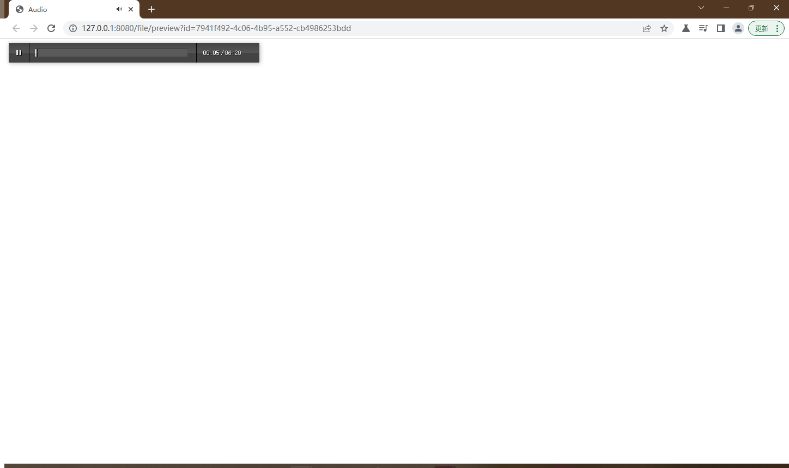

# file-preview-spring-boot-starter

[](https://jitpack.io/#com.gitee.wb04307201/file-preview-spring-boot-starter)

> 文档在线预览快速启动器  
> 只需要简单的配置和编码，即可集成到springboot中  
> 支持word，excel，ppt，pdf，图片，视频，音频，markdown等格式文件的在线预览

## 第一步 增加 JitPack 仓库
```xml
    <repositories>
        <repository>
            <id>jitpack.io</id>
            <url>https://jitpack.io</url>
        </repository>
    </repositories>
```

## 第二步 引入jar
```xml
    <dependency>
        <groupId>com.gitee.wb04307201</groupId>
        <artifactId>chatbot-spring-boot-starter</artifactId>
        <version>Tag</version>
    </dependency>
```

## 第三步 在启动类上加上`@EnableFilePreview`注解

```java
@EnableFilePreview
@SpringBootApplication
public class FilePreviewDemoApplication {

    public static void main(String[] args) {
        SpringApplication.run(FilePreviewDemoApplication.class, args);
    }

}
```

## 第四步 注入IFilePreviewService，并对文件进行转换
> 目的是将 word，ppt转换成pdf excel转换成html，并存储所有的预览文件
> 也可以只记录源文件的位置
```java
    @Autowired
    IFilePreviewService filePreviewService;

    //存储预览文件
    filePreviewService.covert(uploadFile.getAbsolutePath());

    //存储预览文件,预览时再存储预览文件
    filePreviewService.record(uploadFile.getAbsolutePath());
```
### 在针对word，excel，ppt文件的处理上，支持3种模式
#### jodconverter 使用注解@EnableFilePreview或者@EnableFilePreview(convert="jod")
> 安装[libroffice](https://zh-cn.libreoffice.org/)并添加配置
```yml
jodconverter:
  local:
    enabled: true
    # libreOffice根目录
    officeHome: C:\Program Files\LibreOffice
    # 任务执行的超时时间
    taskExecutionTimeout: 86400000
    # 任务队列的超时时间
    taskQueueTimeout: 86400000
    # 端口（线程）
    portNumbers: [2001,2002,2003]
    # 一个进程的超时时间
    processTimeout: 86400000
```
#### spire.office 使用注解@EnableFilePreview(convert="spire")
> 项目中使用的spire.office为免费版本，转换office文件存在一定限制
> 如要使用收费版本，请排除免费版本的依赖并添加正式版本  
> [Spire.Office](https://www.e-iceblue.com/)
#### onlyoffice 使用注解@EnableFilePreview(convert="onlyoffice")
> 使用[onlyoffice](https://www.onlyoffice.com/zh/)将不对office文件进行转换    
> 并使用onlyoffice预览office文件以及pdf，txt等类型的文件  
> 可以通过docker快速安装onlyoffice并添加配置
```yml
file:
  online:
    preview:
      onlyoffice:
        apijs: http://127.0.0.1/web-apps/apps/api/documents/api.js
        download: http://10.133.48.74:8080/file/preview/download
        callback: http://10.133.48.74:8080/file/preview/onlyoffice/callback
```
#### 准备扩展[document4j](https://github.com/documents4j/documents4j)

## 第五步 预览文件（截图为使用onlyoffice进行预览）
> 通过http://127.0.0.1:8080/file/preview?id=?预览文件  
> 通过http://127.0.0.1:8080/file/preview/list查看历史记录





### 示例
https://gitee.com/wb04307201/file-preview-demo