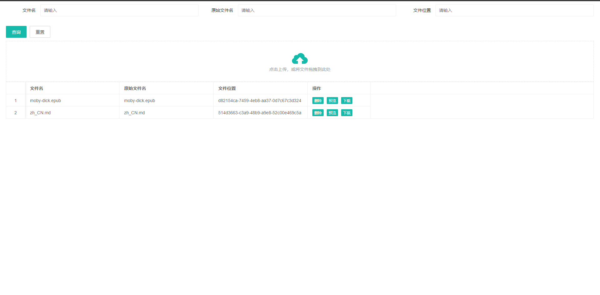

# file-preview-spring-boot-starter

[](https://jitpack.io/#com.gitee.wb04307201/file-preview-spring-boot-starter)

> 一个文档在线预览的中间件  
> 可通过简单的配置即可集成到springboot中  
> 支持word、excel、ppt、pdf、图片、视频、音频、markdown、代码、网页、epub电子书、Xmind脑图等格式文件的在线预览

## [代码示例](https://gitee.com/wb04307201/file-preview-demo)

## 第一步 增加 JitPack 仓库

```xml

<repositories>
    <repository>
        <id>jitpack.io</id>
        <url>https://jitpack.io</url>
    </repository>
</repositories>
```

## 第二步 引入jar

```xml

<dependency>
    <groupId>com.gitee.wb04307201</groupId>
    <artifactId>file-preview-spring-boot-starter</artifactId>
    <version>Tag</version>
</dependency>
```

## 第三步 在启动类上加上`@EnableFilePreview`注解

```java

@EnableFilePreview
@SpringBootApplication
public class FilePreviewDemoApplication {

    public static void main(String[] args) {
        SpringApplication.run(FilePreviewDemoApplication.class, args);
    }

}
```

## 第四步 注入IFilePreviewService，并对文件进行转换

> 目的是将 word，ppt转换成pdf excel转换成html，并存储所有的预览文件
> 也可以只记录源文件的位置

```java
    @Autowired
    FilePreviewService filePreviewService;

    //预览文件转换
    FilePreviewInfo filePreviewInfo=filePreviewService.covert(file.getInputStream(),file.getOriginalFilename());
```

### 在针对word，excel，ppt文件的处理上，支持3种模式

#### jodconverter

> 安装[libroffice](https://zh-cn.libreoffice.org/)并添加配置  
> 详细配置内容请查看[jodconverter](https://github.com/sbraconnier/jodconverter/)

```yaml
file:
  preview:
    # 使用jodconverter模式，可省略该配置
    officeConverter: jod
jodconverter:
  local:
    enabled: true
    # libreOffice根目录
    officeHome: C:\Program Files\LibreOffice
    # 任务执行的超时时间
    taskExecutionTimeout: 86400000
    # 任务队列的超时时间
    taskQueueTimeout: 86400000
    # 端口（线程）
    portNumbers: [ 2001,2002,2003 ]
    # 一个进程的超时时间
    processTimeout: 86400000
```

#### spire.office

> 项目中使用的spire.office为免费版本，转换office文件存在一定限制
> 如要使用收费版本，请排除免费版本的依赖并添加正式版本  
> [Spire.Office](https://www.e-iceblue.com/)

```yaml
file:
  preview:
    # 使用spire.office模式
    officeConverter: spire
```

#### onlyoffice

> 使用[onlyoffice](https://www.onlyoffice.com/zh/)将不对office文件进行转换    
> 并使用onlyoffice预览office文件以及pdf，txt等类型的文件  
> 可以通过docker快速安装onlyoffice，命令如下

```bash
docker run -i -t -d -p 80:80 -e JWT_ENABLED=false onlyoffice/documentserver
```

> 容器启动成功后，打开http://127.0.0.1/可以看到欢迎页面
> 如果需要使用onlyoffice自带的测试页面，可以找页面中如下部分，并分别在终端中执行1，2的命令，然后点击按钮3    
>    
>   
> docker版本的onlyoffice安装成功后，在项目中添加配置信息

```yaml
file:
  preview:
    # 使用onlyoffice模式
    officeConverter: only
  online:
    preview:
      onlyoffice:
        apijs: http://127.0.0.1/web-apps/apps/api/documents/api.js #OnlyOffice服务地址
        download: http://ip:port/file/preview/download #当前服务的ip:port
        callback: http://ip:port/file/preview/onlyoffice/callback #当前服务的ip:port
```

## 第六步 预览文件信息

> 可通过第四步返回的文件信息中的id  
> 访问http://ip:port/file/preview?id=??进行文件预览  
> 如果配置了context-path,请在地址中同样添加  
> 使用了一些开源组件帮助预览文件内容  

| 文件类型           | 预览组件                                                                 | 预览示例                                                                                                                                       |
|----------------|----------------------------------------------------------------------|--------------------------------------------------------------------------------------------------------------------------------------------|
| word/excel/ppt | [jodconverter](https://github.com/sbraconnier/jodconverter/)         |                                                                                                                                            |
| word/excel/ppt | [Spire.Office](https://www.e-iceblue.com/)                           |                                                                                                                                            |
| word/excel/ppt | [onlyoffice](https://www.onlyoffice.com/zh/)                         |  |
| pdf            | [PDF.js](https://mozilla.github.io/pdf.js/)                          |                                                                                             |
| audio音频        | [audio.js](http://kolber.github.io/audiojs/)                         |                                                                                              |
| video视频        | [videojs](https://videojs.com/)                                      |                                                                                              |
| markdonw       | [Marked](https://marked.js.org/)                                     |                                                                                                |
| 代码             | [CodeMirror](https://codemirror.net/)                                |                                               |
| epub电子书        | [epub.js](https://github.com/futurepress/epub.js)                    |                                                                                             |
| xmid脑图         | [xmind-embed-viewer](https://github.com/xmindltd/xmind-embed-viewer) |                                                                                             |
| 网页             | 直接渲染                                                                 |                                                                                             |


## 其他1：内置界面

上传的文件可通过http://ip:端口/file/preview/list进行查看  
注意：如配置了context-path需要在地址中对应添加  


## 其他2：下载文件、删除文件

> 可通过第四步返回的文件信息中的id  
> 访问http://ip:port/file/preview/download?id=??进行文件下载  
> 访问http://ip:port/file/preview/delete?id=??进行文件删除  
> 如果配置了context-path,请在地址中同样添加  
> 也可以调用IFilePreviewService服务中方法自行处理下载和删除

```java
    //获取文件bytes
    byte[] bytes = filePreviewService.download(filePreviewInfo.getId());

    //删除预览文件
    Boolean result = filePreviewService.delete(filePreviewInfo.getId());  
```

## 其他3：实际使用中，可通过配置和实现接口方法将数据持久化到数据库中

```yaml
file:
  preview:
    file-preview-record: cn.wubo.file.preview.demo.H2FilePriviewRecordImpl
```

```java
public class H2FilePriviewRecordImpl implements IFilePreviewRecord {

    private static final String HISTORY = "file_preview_history";

    private static ConnectionPool connectionPool = new ConnectionPool(new ConnectionParam());

    @Override
    public FilePreviewInfo save(FilePreviewInfo filePreviewInfo) {
        try {
            Connection conn = connectionPool.getConnection();
            if (!StringUtils.hasLength(filePreviewInfo.getId())) {
                filePreviewInfo.setId(UUID.randomUUID().toString());
                ExecuteSqlUtils.executeUpdate(conn, ModelSqlUtils.insertSql(HISTORY, filePreviewInfo), new HashMap<>());
            } else {
                ExecuteSqlUtils.executeUpdate(conn, ModelSqlUtils.updateByIdSql(HISTORY, filePreviewInfo), new HashMap<>());
            }
            connectionPool.returnConnection(conn);
        } catch (SQLException | InterruptedException e) {
            throw new RuntimeException(e);
        }
        return filePreviewInfo;
    }

    @Override
    public List<FilePreviewInfo> list(FilePreviewInfo filePreviewInfo) {
        try {
            Connection conn = connectionPool.getConnection();
            String sql = ModelSqlUtils.selectSql(HISTORY, new FileInfo());

            List<String> condition = new ArrayList<>();
            if (StringUtils.hasLength(filePreviewInfo.getFileName()))
                condition.add(" fileName  like '%" + filePreviewInfo.getFileName() + "%'");
            if (StringUtils.hasLength(filePreviewInfo.getOriginalFilename()))
                condition.add(" originalFilename like '%" + filePreviewInfo.getOriginalFilename() + "%'");
            if (StringUtils.hasLength(filePreviewInfo.getFilePath()))
                condition.add(" filePath like '%" + filePreviewInfo.getFilePath() + "%'");

            if (!condition.isEmpty()) sql = sql + " where " + String.join("and", condition);

            List<FilePreviewInfo> res = ExecuteSqlUtils.executeQuery(conn, sql, new HashMap<>(), FilePreviewInfo.class);
            connectionPool.returnConnection(conn);
            return res;
        } catch (SQLException | InterruptedException e) {
            throw new RuntimeException(e);
        }
    }

    @Override
    public FilePreviewInfo findById(String s) {
        FilePreviewInfo query = new FilePreviewInfo();
        query.setId(s);
        String sql = ModelSqlUtils.selectSql(HISTORY, query);
        try {
            Connection conn = connectionPool.getConnection();
            List<FilePreviewInfo> res = ExecuteSqlUtils.executeQuery(conn, sql, new HashMap<>(), FilePreviewInfo.class);
            connectionPool.returnConnection(conn);
            return res.get(0);
        } catch (SQLException | InterruptedException e) {
            throw new RuntimeException(e);
        }
    }

    @Override
    public Boolean deleteById(String s) {
        FilePreviewInfo delete = new FilePreviewInfo();
        delete.setId(s);
        String sql = ModelSqlUtils.deleteByIdSql(HISTORY, delete);
        try {
            Connection conn = connectionPool.getConnection();
            int count = ExecuteSqlUtils.executeUpdate(conn, sql, new HashMap<>());
            connectionPool.returnConnection(conn);
            return count == 1;
        } catch (SQLException | InterruptedException e) {
            throw new RuntimeException(e);
        }
    }

    @Override
    public void init() {

        try {
            Connection conn = connectionPool.getConnection();
            if (!ExecuteSqlUtils.isTableExists(conn, HISTORY, connectionPool.getDbType())) {
                ExecuteSqlUtils.executeUpdate(conn, ModelSqlUtils.createSql(HISTORY, new FilePreviewInfo()), new HashMap<>());
            }
        } catch (SQLException | InterruptedException e) {
            throw new RuntimeException(e);
        }
    }
}
```

## 其他4：实际使用中，可通过配置和实现接口方法将文件持久化到其他平台中

```yaml
file:
  preview:
    file-storage: cn.wubo.file.preview.demo.MinIOFileStorageImpl

```

```java
public class H2FileStroageRecordImpl implements IFileStroageRecord {

    private static final String HISTORY = "file_storage_history";

    private static ConnectionPool connectionPool = new ConnectionPool(new ConnectionParam());

    @Override
    public FileInfo save(FileInfo fileInfo) {
        try {
            Connection conn = connectionPool.getConnection();
            if (!StringUtils.hasLength(fileInfo.getId())) {
                fileInfo.setId(UUID.randomUUID().toString());
                ExecuteSqlUtils.executeUpdate(conn, ModelSqlUtils.insertSql(HISTORY, fileInfo), new HashMap<>());
            } else {
                ExecuteSqlUtils.executeUpdate(conn, ModelSqlUtils.updateByIdSql(HISTORY, fileInfo), new HashMap<>());
            }
            connectionPool.returnConnection(conn);
        } catch (SQLException | InterruptedException e) {
            throw new RuntimeException(e);
        }
        return fileInfo;
    }

    @Override
    public List<FileInfo> list(FileInfo fileInfo) {
        try {
            Connection conn = connectionPool.getConnection();
            String sql = ModelSqlUtils.selectSql(HISTORY, new FileInfo());

            List<String> condition = new ArrayList<>();
            if (StringUtils.hasLength(fileInfo.getPlatform()))
                condition.add(" platform = '" + fileInfo.getPlatform() + "'");
            if (StringUtils.hasLength(fileInfo.getAlias()))
                condition.add(" alias like '%" + fileInfo.getAlias() + "%'");
            if (StringUtils.hasLength(fileInfo.getOriginalFilename()))
                condition.add(" originalFilename like '%" + fileInfo.getOriginalFilename() + "%'");

            if (!condition.isEmpty()) sql = sql + " where " + String.join("and", condition);

            List<FileInfo> res = ExecuteSqlUtils.executeQuery(conn, sql, new HashMap<>(), FileInfo.class);
            connectionPool.returnConnection(conn);
            return res;
        } catch (SQLException | InterruptedException e) {
            throw new RuntimeException(e);
        }
    }

    @Override
    public FileInfo findById(String s) {
        FileInfo fileInfo = new FileInfo();
        fileInfo.setId(s);
        String sql = ModelSqlUtils.selectSql(HISTORY, fileInfo);
        try {
            Connection conn = connectionPool.getConnection();
            List<FileInfo> res = ExecuteSqlUtils.executeQuery(conn, sql, new HashMap<>(), FileInfo.class);
            connectionPool.returnConnection(conn);
            return res.get(0);
        } catch (SQLException | InterruptedException e) {
            throw new RuntimeException(e);
        }
    }

    @Override
    public Boolean delete(FileInfo fileInfo) {
        FileInfo delete = new FileInfo();
        delete.setId(fileInfo.getId());
        String sql = ModelSqlUtils.deleteByIdSql(HISTORY, delete);
        try {
            Connection conn = connectionPool.getConnection();
            int count = ExecuteSqlUtils.executeUpdate(conn, sql, new HashMap<>());
            connectionPool.returnConnection(conn);
            return count == 1;
        } catch (SQLException | InterruptedException e) {
            throw new RuntimeException(e);
        }
    }

    @Override
    public void init() {
        try {
            Connection conn = connectionPool.getConnection();
            if (!ExecuteSqlUtils.isTableExists(conn, HISTORY, connectionPool.getDbType())) {
                ExecuteSqlUtils.executeUpdate(conn, ModelSqlUtils.createSql(HISTORY, new FileInfo()), new HashMap<>());
            }
        } catch (SQLException | InterruptedException e) {
            throw new RuntimeException(e);
        }
    }
}
```

*注意：
文件存储这部分使用了[file-storage-spring-boot-starter](https://gitee.com/wb04307201/file-storage-spring-boot-starter)*

## 未来可能的工作？

- [ ] *扩展对压缩文件的支持*

- [ ] *扩展对LogicFlow文件的支持*

- [ ] *扩展libreoffice online*

[libreoffice online](https://zh-cn.libreoffice.org/download/libreoffice-online/)

- [ ] *扩展Collabora Online*

[Collabora Online](https://www.collaboraoffice.com/)  
[docs](https://sdk.collaboraonline.com/docs/installation/CODE_Docker_image.html)
